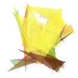

# 🧬 Evolução por Algoritmo Genético

*Visualização da evolução de uma imagem gerada por algoritmo genético.*

---

## 📌 Sobre

Este projeto utiliza **algoritmos genéticos** para gerar e evoluir uma imagem ao longo de gerações, demonstrando como técnicas de computação evolutiva podem aproximar progressivamente uma imagem-alvo a partir de formas aleatórias.

---

## 🔄 Evolução

| Antes | Depois |
|-------|--------|
|  |  |
| Geração inicial — formas aleatórias | Geração final — imagem evoluída |

---